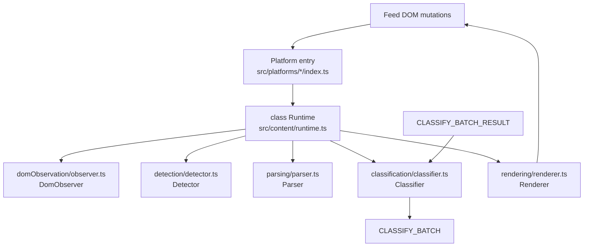
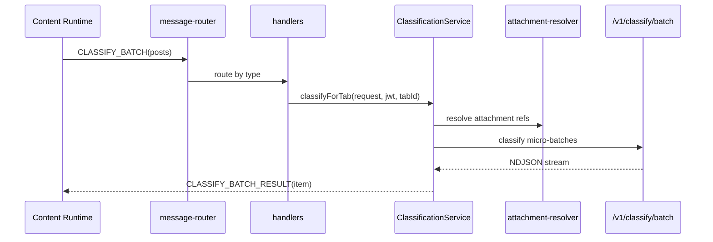

# AGENTS.md – Chrome Extension

You are working in the **Chrome extension** that filters social media feeds (LinkedIn, X/Twitter, Reddit).

## Architecture Overview

```
┌─────────────────────────────────────────────────────────────────────────────┐
│  CONTENT (per-tab, platform-specific)                                       │
│  src/platforms/{linkedin,x,reddit}/index.ts → new Runtime(plugin).start()  │
│  src/content/runtime.ts  (class Runtime)                                    │
│  src/content/domObservation/  src/content/classification/                   │
│  src/content/rendering/  src/content/parsing/  src/content/detection/       │
│  src/content/diagnostics/  src/content/auth/                                │
└─────────────────────────────────────────────────────────────────────────────┘
                                    │
                    chrome.runtime.sendMessage / onMessage
                                    │
┌──────────────────────────────────────────────────────────────────────────────┐
│  BACKGROUND (service worker)                                                 │
│  src/background/index.ts → message-router, handlers                          │
│  src/background/classification-service.ts  classify-pipeline.ts              │
│  src/background/attachment-resolver.ts  storage-facade.ts  diagnostics-engine│
└──────────────────────────────────────────────────────────────────────────────┘
                                    │
                              HTTP /v1/classify/batch
                                    │
┌─────────────────────────────────────────────────────────────────────────────┐
│  POPUP / STATS (UI only)                                                    │
│  src/popup/App.ts  diagnostics-client.ts  src/stats/index.ts                │
└─────────────────────────────────────────────────────────────────────────────┘
```

## Content Flow (Classification Loop)



## Background + API Flow



## Entry Points

| Entry | Path | Role |
|-------|------|------|
| Manifest | `manifest.json` | Content script injection per platform; auth callback on `api.getunslop.com` |
| Platform entry | `src/platforms/{linkedin,x,reddit}/index.ts` | Calls `registerContentDiagnosticsHost(plugin)` and `new Runtime(plugin).start()` |
| Runtime | `src/content/runtime.ts` | class Runtime: lifecycle, pipeline wiring, storage hydration, navigation detection |
| Background | `src/background/index.ts` | Registers message router + handlers |
| Popup | `src/popup/App.ts` | UI shell; diagnostics via `diagnostics-client.ts` |
| Auth callback | `src/content/auth/auth.ts` | Extracts JWT from page, sends to background |

## Module Roles

### Content (`src/content/`)

| Module | Path | Role |
|--------|------|------|
| **Runtime** | `runtime.ts` | class Runtime: lifecycle, reconcile, storage, pipeline wiring |
| | `runtime/controller.ts` | Route + enabled state; modes: `disabled`, `enabled_attaching`, `enabled_active` |
| | `runtime/lifecycle.ts`, `runtime/observability.ts` | State and event tracking |
| **DOM Observation** | `domObservation/observer.ts` | class DomObserver: feed/body observer lifecycle, node callbacks |
| | `domObservation/attachment.ts` | Feed/body observer lifecycle; `ensureAttached`, `detachAll`, `isLive` |
| | `domObservation/mutation.ts` | Deduplicated candidate queue; drained per frame |
| | `domObservation/watchdog.ts` | Detects pipeline stall; triggers recovery reattach |
| **Detection** | `detection/detector.ts` | class Detector: public API for surface detection + cache persistence |
| | `detection/engine.ts` | Hint collection → prune → score → resolve roots → identity |
| | `detection/candidate-pruner.ts`, `feature-extractor.ts`, `fingerprint.ts`, `relocalizer.ts`, `reliability-store.ts` | Supporting detection pipeline |
| **Parsing** | `parsing/parser.ts` | class Parser: thin wrapper over `platform.extractPostData()` |
| **Classification** | `classification/classifier.ts` | class Classifier: classify with cache + batch dispatcher |
| | `classification/batchDispatcher.ts` | Batching, pending `post_id` promises; resolves from streamed results |
| | `classification/batchQueue.ts` | Wrapper over BatchDispatcher |
| | `classification/pendingCoordinator.ts` | 3s fail-open timer when in viewport; late `hide` when identity current |
| **Rendering** | `rendering/renderer.ts` | class Renderer: apply decisions to DOM surfaces |
| | `rendering/commitPipeline.ts` | Coalesces by renderRoot; flushes by RAF |
| | `rendering/decisionRenderer.ts` | Applies `keep|hide`; modes: `collapse`, `label` |
| | `rendering/markerManager.ts` | Clears markers; lifecycle reset |
| **Diagnostics** | `diagnostics/diagnostics-host.ts` | `GET_CONTENT_DIAGNOSTICS`; dev-mode gated; delegates to platform |
| **Auth** | `auth/auth.ts` | JWT extraction from auth callback page |

### Platforms (`src/platforms/`)

| Module | Path | Role |
|--------|------|------|
| Interface | `platform.ts` | `PlatformPlugin` contract |
| Plugin | `{linkedin,x,reddit}/plugin.ts` | Wires selectors, parser, route-detector, detection-profile (content/render/label roots), diagnostics |
| Per platform | `selectors.ts`, `parser.ts`, `route-detector.ts`, `detection-profile.ts` | Platform-specific DOM logic |
| Shared | `platform-diagnostics.ts` | Shared platform-owned DOM checks |

### Background (`src/background/`)

| Module | Path | Role |
|--------|------|------|
| Bootstrap | `index.ts` | Registers `createMessageRouter(createBackgroundMessageHandlers())` |
| Router | `message-router.ts` | `type` → handler; converts thrown errors to `{ error: "Internal error" }` |
| Handlers | `handlers.ts` | classify/auth/jwt/toggle/reload/stats/diagnostics |
| Classify | `classification-service.ts` | Streams results to content; fail-open items |
| | `classify-pipeline.ts` | Resolves attachments; dispatches micro-batches; caps in-flight requests |
| Resolver | `attachment-resolver.ts` | Image: sha256+base64; PDF: excerpt; fail-open per attachment |
| Storage | `storage-facade.ts` | JWT/enabled reads and writes |
| Diagnostics | `diagnostics-engine.ts` | Runtime checks; dev-mode gated |

### Shared (`src/lib/`)

| Module | Path | Role |
|--------|------|------|
| Messages | `messages.ts` | Message type constants and typed request/response shapes |
| Selectors | `selectors.ts` | Shared ATTRIBUTES, auth selectors (no platform selectors) |
| Config | `config.ts` | API_BASE_URL, BATCH_*, CACHE_*, DEBUG_CONTENT_RUNTIME, HIDE_RENDER_MODE |

## Binding Rules (Constitution)

- **Scope**: detect posts, request decision, apply `keep|hide`; auth, subscription, usage, stats; fail open on every error.
- **Out of scope**: heuristic classifiers, per-author tuning, analytics dashboards.
- **Boundaries**: `background/` = transport + API; `content/` = DOM observation + extraction + rendering; `popup/`, `stats/` = UI only; `lib/` = pure helpers.
- **Rules**: DOM parsing and rendering separate; message contracts centralized; storage defaults centralized; typed message shapes; no secrets in logs.
- **Prohibited**: scope expansion during maintenance; bypassing fail-open; parallel TS/JS drift.

## Diagnostics Quick Reference

- **Entry**: Popup `Run Diagnostics` (dev-mode gated).
- **Key checks**: `content_script_reachable` → `content/diagnostics/diagnostics-host.ts`; `platform_*` → `platforms/platform-diagnostics.ts`; `runtime_pipeline_counters` from observability snapshot.
- **No classify traffic**: Run diagnostics; check `content_script_reachable`, `platform_*`, `content/runtime.ts` gates, `classification/batchDispatcher.ts`. If `platform_identity_ready` fails, inspect platform `parser.ts` (readPostIdentity).
- **Hide not applied**: Inspect `classification/pendingCoordinator.ts`, `rendering/commitPipeline.ts`, `rendering/decisionRenderer.ts`.

## Setup & Commands

From `extension/`:

```bash
bun install
bun run dev
bun run build
bun test src/
bun test src/content    # content tests only
bun test src/platforms  # platform tests only
bunx tsc --noEmit --noUnusedLocals --noUnusedParameters -p tsconfig.json
```

## Adding a New Platform

1. Create `src/platforms/<platform>/` with `selectors.ts`, `parser.ts`, `route-detector.ts`, `detection-profile.ts`, `plugin.ts`, `index.ts`.
2. Implement `PlatformPlugin` from `src/platforms/platform.ts`.
3. Add content script entry + host permissions in `manifest.json`.
4. Add origin to backend CORS allowlist in `backend/src/app/create-app.ts`.
5. Add tests; run `bun test src/platforms/plugin-compliance.test.ts`.

## Prohibited

- Platform-specific logic outside `src/platforms/<platform>/`.
- `instanceof HTMLElement` in parsers (use duck-type checks for bun test).
- Importing platform selectors from `src/lib/selectors.ts` (only shared ATTRIBUTES and auth selectors).

## References

- Product spec: `../docs/product-specs/extension.md`
- API spec: `../docs/product-specs/api.md`
