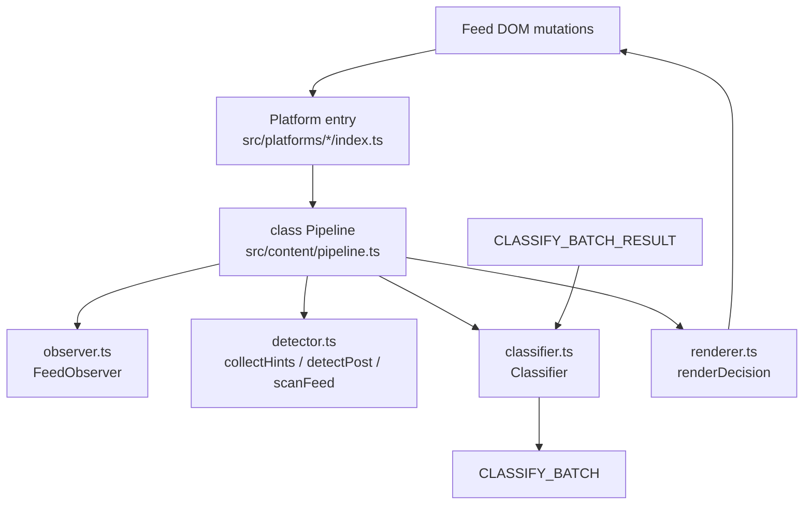

# AGENTS.md – Chrome Extension

You are working in the **Chrome extension** that filters social media feeds (LinkedIn, X/Twitter, Reddit).

## Architecture Overview

```
┌─────────────────────────────────────────────────────────────────────────────┐
│  CONTENT (per-tab, platform-specific)                                       │
│  src/platforms/{linkedin,x,reddit}/index.ts → createPlatformRuntime(plugin) │
│  src/content/pipeline.ts  (class Pipeline)                                  │
│  src/content/observer.ts  classifier.ts  detector.ts  renderer.ts           │
│  src/content/navigation.ts  state.ts  types.ts  auth/                       │
└─────────────────────────────────────────────────────────────────────────────┘
                                    │
                    chrome.runtime.sendMessage / onMessage
                                    │
┌──────────────────────────────────────────────────────────────────────────────┐
│  BACKGROUND (service worker)                                                 │
│  src/background/index.ts → messageRouter, handlers                           │
│  src/background/classificationService.ts  classifyPipeline.ts                │
│  src/background/attachmentResolver.ts  storageFacade.ts  diagnosticsEngine.ts│
└──────────────────────────────────────────────────────────────────────────────┘
                                    │
                              HTTP /v1/classify/batch
                                    │
┌─────────────────────────────────────────────────────────────────────────────┐
│  POPUP / STATS (UI only)                                                    │
│  src/popup/index.ts  App.ts  diagnosticsClient.ts  src/stats/index.ts       │
└─────────────────────────────────────────────────────────────────────────────┘
```

## Content Flow (Classification Loop)



## Background + API Flow


## Entry Points

| Entry | Path | Role |
|-------|------|------|
| Manifest | `manifest.json` | Content script injection per platform; auth callback on `api.getunslop.com` |
| Platform entry | `src/platforms/{linkedin,x,reddit}/index.ts` | Calls `createPlatformRuntime(plugin)` |
| Pipeline | `src/content/pipeline.ts` | class Pipeline: lifecycle, pipeline wiring, storage hydration, navigation detection |
| Background | `src/background/index.ts` | Registers message router + handlers |
| Popup | `src/popup/index.ts` | UI shell; diagnostics via `diagnosticsClient.ts` |
| Auth callback | `src/content/auth/auth.ts` | Extracts JWT from page, sends to background |

## Module Roles

### Content (`src/content/`)

| Module | Path | Role |
|--------|------|------|
| **Pipeline** | `pipeline.ts` | class Pipeline: orchestrator; lifecycle (start/stop), reconcile, route detection, message/storage listeners |
| **DOM Observation** | `observer.ts` | class FeedObserver: two-phase attach (body→feed), MutationObserver lifecycle, node dispatch |
| **Detection** | `detector.ts` | `collectHints()`, `detectPost()`, `scanFeed()` — scoring-based ancestor walk; resolves content/render/label roots + identity |
| **Classification** | `classifier.ts` | class Classifier: decision cache, batch queue, flush on window/threshold, fail-open timeout |
| **Rendering** | `renderer.ts` | `renderDecision()`, `clearAllDecisions()` — applies keep/hide; modes: collapse, label |
| **Navigation** | `navigation.ts` | class NavigationHandler: monkey-patches history.pushState/replaceState, listens popstate |
| **State** | `state.ts` | `PipelineState`: enabled, hideMode, routeKey, processed WeakSet |
| **Types** | `types.ts` | `DetectedSurface`: contentRoot, renderRoot, labelRoot, identity |
| **Auth** | `auth/auth.ts` | JWT extraction from auth callback page |

### Platforms (`src/platforms/`)

| Module | Path | Role |
|--------|------|------|
| Interface | `platform.ts` | `PlatformPlugin` contract |
| Plugin | `{linkedin,x,reddit}/plugin.ts` | Wires parser, routeDetector, detectionProfile |
| Per platform | `parser.ts`, `routeDetector.ts`, `detectionProfile.ts` | Platform-specific DOM logic |
| Shared | `platformDiagnostics.ts` | Shared platform-owned DOM checks (`collectContentDiagnostics`) |

### Background (`src/background/`)

| Module | Path | Role |
|--------|------|------|
| Bootstrap | `index.ts` | Registers `createMessageRouter(createBackgroundMessageHandlers())` |
| Router | `messageRouter.ts` | `type` → handler; converts thrown errors to `{ error: "Internal error" }` |
| Handlers | `handlers.ts` | classify/auth/jwt/toggle/reload/stats/diagnostics |
| Classify | `classificationService.ts` | Streams results to content; fail-open items |
| | `classifyPipeline.ts` | Resolves attachments; dispatches micro-batches; caps in-flight requests |
| Resolver | `attachmentResolver.ts` | Image: sha256+base64; PDF: excerpt; fail-open per attachment |
| Storage | `storageFacade.ts` | JWT/enabled reads and writes |
| Diagnostics | `diagnosticsEngine.ts` | Runtime checks; dev-mode gated |

### Shared (`src/lib/`)

| Module | Path | Role |
|--------|------|------|
| Messages | `messages.ts` | Message type constants and typed request/response shapes |
| Selectors | `selectors.ts` | Shared ATTRIBUTES, auth selectors (no platform selectors) |
| Config | `config.ts` | API_BASE_URL, BATCH_*, CACHE_*, timings, HideRenderMode |
| Storage | `storage.ts` | `decisionCache`, `userData` singleton instances |
| Decision Cache | `decisionCache.ts` | DecisionCacheService: TTL-based cache with cleanup |
| User Data | `userData.ts` | UserDataService |
| Enabled State | `enabledState.ts` | `resolveEnabled()`, `toggleEnabled()` |
| Hide Render Mode | `hideRenderMode.ts` | `resolveHideRenderMode()` |
| Dev Mode | `devMode.ts` | `resolveDevMode()`, `toggleDevMode()` |
| Diagnostics types | `diagnostics.ts` | Type definitions for diagnostics responses |
| Windowed Batcher | `windowedBatcher.ts` | Windowed batching utility |
| Media Hydration | `mediaHydration.ts` | Media attachment resolution helpers |
| Hash | `hash.ts` | Hashing utilities |

## Binding Rules (Constitution)

- **Scope**: detect posts, request decision, apply `keep|hide`; auth, subscription, usage, stats; fail open on every error.
- **Out of scope**: heuristic classifiers, per-author tuning, analytics dashboards.
- **Boundaries**: `background/` = transport + API; `content/` = DOM observation + extraction + rendering; `popup/`, `stats/` = UI only; `lib/` = pure helpers.
- **Rules**: DOM parsing and rendering separate; message contracts centralized; storage defaults centralized; typed message shapes; no secrets in logs.
- **Prohibited**: scope expansion during maintenance; bypassing fail-open; parallel TS/JS drift.

## Diagnostics Quick Reference

- **Entry**: Popup `Run Diagnostics` (dev-mode gated).
- **Key checks**: `content_script_reachable` → `pipeline.ts` (`setupMessageListener`); `platform_*` → `platforms/platformDiagnostics.ts`; pipeline counters from `pipeline.ts` state.
- **No classify traffic**: Run diagnostics; check `content_script_reachable`, `platform_*`, `pipeline.ts` gates, `content/classifier.ts`. If `platform_identity_ready` fails, inspect platform `parser.ts` (`readPostIdentity`).
- **Hide not applied**: Inspect `content/classifier.ts` (fail-open timer), `content/renderer.ts` (`renderDecision`).

## Setup & Commands

From `extension/`:

```bash
bun install
bun run dev
bun run build
bun test src/
bun test src/content    # content tests only
bun test src/platforms  # platform tests only
bunx tsc --noEmit --noUnusedLocals --noUnusedParameters -p tsconfig.json
```

## Adding a New Platform

1. Create `src/platforms/<platform>/` with `parser.ts`, `routeDetector.ts`, `detectionProfile.ts`, `plugin.ts`, `index.ts`.
2. Implement `PlatformPlugin` from `src/platforms/platform.ts`.
3. Add content script entry + host permissions in `manifest.json`.
4. Add origin to backend CORS allowlist in `backend/src/app/create-app.ts`.
5. Add tests; run `bun test src/platforms/pluginCompliance.test.ts`.

## Prohibited

- Platform-specific logic outside `src/platforms/<platform>/`.
- `instanceof HTMLElement` in parsers (use duck-type checks for bun test).
- Importing platform selectors from `src/lib/selectors.ts` (only shared ATTRIBUTES and auth selectors).

## References

- Product spec: `../docs/product-specs/extension.md`
- API spec: `../docs/product-specs/api.md`
