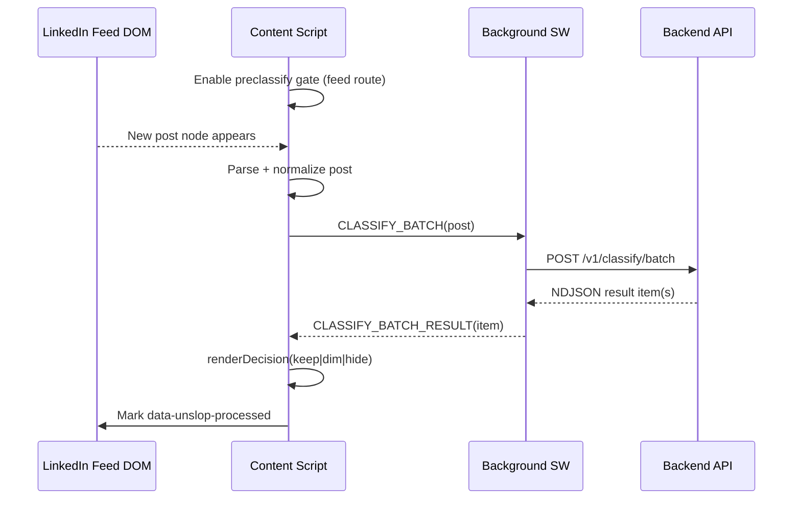

# Unslop Chrome Extension

Unslop is a Chrome MV3 extension that filters the LinkedIn home feed in real time.
It does one thing end to end:

1. Detect feed posts.
2. Ask backend for `keep | dim | hide`.
3. Render that decision safely (fail-open on any error).

This document explains the full runtime as a coherent system, not just a file list.

## 1) System Story (30-Second Mental Model)

Think of the extension as three cooperating runtimes:

- `Content runtime (LinkedIn tab)`
  Finds posts, manages DOM lifecycle, requests classification, and applies UI decisions.
- `Background runtime (service worker)`
  Handles authenticated API transport and streams batch decisions back to the tab.
- `Popup runtime`
  Lets user sign in, toggle enabled state, choose hide render mode, and view account/usage status.

Core UX strategy:

- Pre-hide new feed posts immediately (preclassify gate).
- Reveal only after terminal decision is applied.
- Never break LinkedIn if Unslop fails.

## 2) Architecture Diagrams

### 2.1 Runtime Topology

```mermaid
flowchart LR
  A[LinkedIn DOM] --> B[Content Script\nlinkedin.ts]
  B --> C[Batch Queue\nbatch-queue.ts]
  C --> D[chrome.runtime.sendMessage\nCLASSIFY_BATCH]
  D --> E[Background SW\nbackground/index.ts]
  E --> F[/v1/classify/batch\nNDJSON stream]
  F --> E
  E --> G[CLASSIFY_BATCH_RESULT\nper post]
  G --> B
  B --> H[Decision Renderer\ndecision-renderer.ts]
  H --> A

  B --> I[Attachment Controller\nattachment-controller.ts]
  B --> J[Preclassify Gate\npreclassify-gate.ts]
  B --> K[Watchdog\nstarvation-watchdog.ts]
```

### 2.2 End-to-End Sequence



### 2.3 Attachment/Liveness Control Loop (ASCII)

```text
Route sync tick/event
  -> compute routeKey
  -> if non-feed: detach observers, disable gate, reset watchdog
  -> if feed:
       sync enabled state -> gate on/off
       ensureAttached(routeKey, force?)
         |- if feed root exists: attach feed observer
         |- else: attach body observer waiting for feed

Watchdog tick
  -> read candidatesVisible, processedDelta, classifyDelta, observerLive
  -> if stalled threshold reached: force reattach
```

## 3) Glossary (Canonical Terms)

- `Candidate Post Root`
  Outer LinkedIn feed card root matching `.feed-shared-update-v2[role="article"][data-urn^="urn:li:activity:|share:"]`.

- `Route Key`
  Normalized pathname from URL with trailing slash (example: `/feed/`).

- `Preclassify Gate`
  `data-unslop-preclassify="true"` on `<html>`. While active, unprocessed feed posts are hidden.

- `Processing Marker`
  `data-unslop-checking`. Post is currently being parsed/classified.

- `Processed Marker`
  `data-unslop-processed`. Post reached terminal state and should not be reprocessed.

- `Lifecycle Generation`
  Monotonic number incremented on feed observer attach. Stale mutation callbacks are ignored.

- `Observer Liveness`
  Attachment controller signal indicating observer state is still healthy and relevant.

- `Fail Open`
  Any runtime/API failure resolves as `keep` and does not disrupt LinkedIn rendering.

- `Hide Mode`
  Configurable render style for hidden posts:
  - `collapse` (default): post node remains mounted but is `display: none`
  - `stub` (debug): minimal stub with unhide action

## 4) End-to-End Flow as a Story

### Phase A: Bootstrap

When LinkedIn page loads, `src/content/linkedin.ts` executes at `document_start`.
If URL is a feed route, it enables preclassify gate immediately before async work.
This is the anti-flicker move: posts should not flash visible and then disappear.

Then runtime initialization registers:

- navigation hooks (`pushState`, `replaceState`, `popstate`, `visibilitychange`, route poll)
- background result listener (`CLASSIFY_BATCH_RESULT`)
- storage listener for enabled toggle changes
- storage listener for hide render mode changes
- watchdog interval

### Phase B: Attachment

On each route sync, content runtime computes route key and asks:

- Is this a feed route?
- Are observers attached and live?
- Is feed root present right now?

`attachment-controller.ts` owns this logic.
It guarantees idempotent attach behavior and clean detach on non-feed routes.
If feed root is not mounted yet, it switches to a body observer wait mode.

### Phase C: Candidate Intake

Feed observer mutations produce added DOM nodes.
`mutation-buffer.ts` deduplicates candidates and drains in `requestAnimationFrame` slices.
This avoids eager per-mutation heavy work and smooths main-thread pressure.

### Phase D: Per-Post Processing

For each candidate element:

1. Skip if already `processed` or `checking`.
2. Parse via `linkedin-parser.ts` into `PostData`.
3. If extension is disabled, do nothing (no marker writes, no decision rendering).
4. If enabled:
- check decision cache
- if miss, enqueue batch classify request
- wait with timeout wrapper
5. Render terminal decision via `decision-renderer.ts`.
6. Mark processed.

### Phase E: Background Transport

`background/index.ts` receives `CLASSIFY_BATCH` and verifies:

- JWT exists
- extension enabled
- sender tab exists

Then `background/api.ts` calls `/v1/classify/batch`.
Results arrive as NDJSON stream and are forwarded item-by-item back to the tab.

### Phase F: Recovery and Stability

`starvation-watchdog.ts` runs periodic health checks:

- are unprocessed candidates accumulating?
- is processing/classify progress stalled?
- are observers live?

If stall threshold is reached, it triggers forced reattach.
This recovers from SPA container swaps and stale observer states.

## 5) Module Responsibilities

### 5.1 Content Orchestration

`src/content/linkedin.ts`

- Owns runtime wiring and control loop.
- Owns route sync scheduling and watchdog startup.
- Delegates state transitions to `runtime-controller.ts`.
- Delegates parsing, rendering, attachment, batching, and cleanup to specialized modules.

Input:

- LinkedIn DOM mutations
- route changes
- storage/auth state
- background classify result messages

Output:

- decision rendering on posts
- observer lifecycle commands
- classify batch requests

Invariants:

- no uncaught fatal path may break page
- disabled mode has zero post-processing side effects
- enabled mode owns all post markers
- stale generation mutations are ignored

### 5.2 Runtime Controller

`src/content/runtime-controller.ts`

- Single orchestrator for lifecycle transitions:
  - `disabled`
  - `enabled_attaching`
  - `enabled_active`
- Reconciliation entry point for `init`, `route`, `toggle`, `visibility`, and `watchdog`.
- Ensures transitions are idempotent and route-aware.

Invariants:

- toggle and route changes do not bypass the controller
- watchdog recovery goes through the same reconcile path
- disabled transition performs full cleanup

### 5.3 Attachment Controller

`src/content/attachment-controller.ts`

- Single source of truth for feed/body observer ownership.
- Provides `ensureAttached({ routeKey, force })`, `detachAll()`, `isLive()`.

Invariants:

- observers do not stack
- stale/disconnected feed roots trigger reattach
- non-feed routes fully detach

### 5.4 Marker Manager

`src/content/marker-manager.ts`

- Owns cleanup of Unslop-owned DOM state:
  - attributes (`processed`, `processing`, `decision`)
  - classes (`unslop-hidden-post`, `unslop-hidden-post-stub`)
  - injected UI (`unslop-hidden-stub`, `unslop-dim-header`)
- Used during disabled transition to guarantee clean restart on next enable.

Invariants:

- only Unslop-owned DOM artifacts are removed
- cleanup is safe to run repeatedly

### 5.5 Preclassify Gate

`src/content/preclassify-gate.ts`

- Only module allowed to set/remove preclassify attribute.
- Enables sync bootstrap + async enabled-state reconciliation.

Invariants:

- feed bootstrap can set gate before async enabled read
- non-feed routes clear gate

### 5.6 Parser

`src/content/linkedin-parser.ts`

- Extracts strict feed post data.
- Rejects non-feed false positives.

Output contract:

- `PostData | null`
- never throws up fatal path

### 5.7 Renderer

`src/content/decision-renderer.ts`

- Applies terminal UI for `keep | dim | hide`.
- Clears transitional state before applying final state.

Invariants:

- hide keeps node mounted
- collapse mode has no visible replacement text
- processed marker remains authoritative terminal state

### 5.6 Batch Queue

`src/content/batch-queue.ts`

- Aggregates outgoing classify posts into short windows.
- Matches incoming per-item results to pending resolvers.
- Fails pending items open on timeout.

### 5.7 Watchdog

`src/content/starvation-watchdog.ts`

- Encapsulates stall policy from runtime counters + liveness.
- Calls recover callback when threshold exceeded.

### 5.8 Route Detection

`src/content/route-detector.ts`

- Canonical route normalization and feed-route eligibility.

### 5.9 Background API Transport

`src/background/index.ts`, `src/background/api.ts`, `src/background/ndjson.ts`

- Message handling and auth checks.
- Backend calls (`/v1/classify/batch`, `/v1/me`, `/v1/usage`, `/v1/stats`, auth/billing).
- Stream parse NDJSON to per-item events.

### 5.10 Shared Contracts

`src/lib/messages.ts`, `src/lib/selectors.ts`, `src/lib/config.ts`, `src/types.ts`

- message constants and response typings
- selector/attribute source of truth
- runtime constants (timeouts, batch/cache knobs, hide mode)
- data models

## 6) Data and State Contracts

### 6.1 Data Attributes

Defined in `src/lib/selectors.ts`:

- `data-unslop-processed`
- `data-unslop-checking`
- `data-unslop-decision`
- `data-unslop-preclassify`

### 6.2 Storage Keys

- `jwt` (auth token)
- `enabled` (defaults true semantics via helper)
- `hideRenderMode` (`collapse` or `stub`; defaults to `HIDE_RENDER_MODE`)
- `decisionCache` (bounded, TTL-managed)

### 6.3 Decision Sources

- `llm`
- `cache`
- `error` (fail-open path)

## 7) Configuration Guide

`src/lib/config.ts`

- `API_BASE_URL`
- `CLASSIFY_TIMEOUT_MS` (currently 2000ms)
- `BATCH_WINDOW_MS`, `BATCH_MAX_ITEMS`, `BATCH_RESULT_TIMEOUT_MS`
- `CACHE_TTL_MS`, `CACHE_MAX_ITEMS`
- `HIDE_RENDER_MODE` (`collapse` or `stub`)
  - default fallback when storage value is missing/invalid
- `HIDE_RENDER_MODE_STORAGE_KEY` (`hideRenderMode`)

Recommended defaults:

- keep `collapse` in normal usage
- use `stub` only for local debugging/QA

User override path:

- popup setting writes `hideRenderMode` to `chrome.storage.sync`
- content runtime listens to storage changes and immediately reconciles already-hidden posts

## 8) Failure Handling and Resilience

Expected fail-open behavior:

- parse error -> `keep`
- classify timeout -> `keep`
- missing stream result -> `keep`
- network/auth failure -> no destructive DOM behavior

Recovery behavior:

- route sync re-evaluates observer attachment
- watchdog can force reattach on stalls
- generation checks discard stale mutation callbacks

## 9) Development and Verification

From `extension/`:

```bash
bun install
bun run dev
bun run build
```

Tests:

```bash
cd extension
bun test
bunx tsc --noEmit --noUnusedLocals --noUnusedParameters -p tsconfig.json
bun run build
```

Load unpacked extension:

1. `bun run build`
2. Open `chrome://extensions/`
3. Enable Developer Mode
4. Load unpacked `extension/dist`

## 10) Troubleshooting Playbook

### Symptom: No classify calls after navigation

1. Verify route key is `/feed/`.
2. Verify attachment controller state has active observer.
3. Verify feed selector resolves in current LinkedIn DOM.
4. Verify watchdog can trigger reattach.

### Symptom: Post flashes before hide

1. Confirm content script still runs at `document_start` in `manifest.json`.
2. Confirm preclassify gate appears immediately on feed route.
3. Confirm gate only clears when disabled/non-feed.

### Symptom: Long empty feed / invisible scrolling region

1. Confirm hidden posts are `.unslop-hidden-post { display: none !important; }`.
2. Confirm posts reach terminal `processed` state.
3. Confirm mutation buffer drain keeps running.

## 11) Maintenance Rules

- Keep module boundaries strict:
  - parser parses
  - renderer renders
  - attachment controller attaches/detaches
  - orchestrator coordinates
- Keep fail-open behavior explicit.
- Do not create ad-hoc message strings outside `messages.ts`.
- Remove dead code instead of leaving dormant branches.
- Keep README aligned with current implementation and constants in every extension change.

## 12) Related Docs

- `extension/AGENTS.md`
- `extension/docs/constitution.md`
- `extension/docs/architecture/attachment-and-preclassify.md`
- `spec/extension.md`
